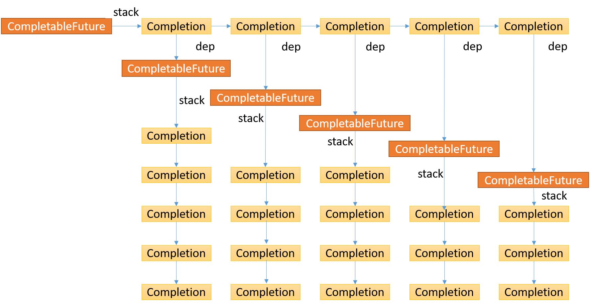
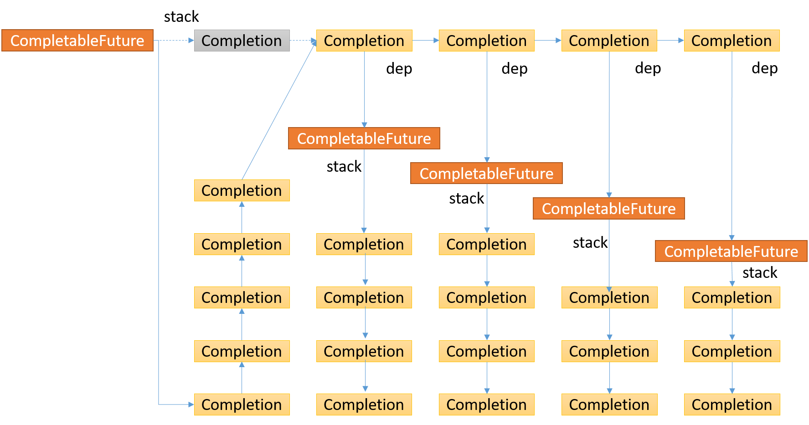

CompletableFuture 是继FutuerTask之后，JDK1.8 引入的异步执行框架，可以自动检测触发下一级的关联任务，而不需要像 ``FutureTask`` 那样通过 ``get`` 获取结果后在执行的阻塞方式。
'

## 1. CompletionStage 接口 

用来表示每个任务执行的一个阶段，通过触发机制，可以在它依赖的任务完成时，执行一些操作和计算 ``CompletableFuture`` 继承自CompletionStage 用来控制类的执行

### 1.1 接口包含的方法

``` java
// 将上一个stage的结果转化成新的类型或值
public <U> CompletionStage<U> thenApply(Function<? super T,? extends U> fn);

// 接收上一个的结果值并进行处理,，无返回值
public CompletionStage<Void> thenAccept(Consumer<? super T> action);

// 在上一个stage有结果后，执行一段新的操作,，无返回值
public CompletionStage<Void> thenRun(Runnable action);
// 结合两个CompletableStage的结果，转化成新的类型或值
public <U,V> CompletionStage<V> thenCombine (CompletionStage<? extends U> other, BiFunction<? super T,? super U,? extends V> fn);
// 等待两个stage都返回后在使用两个结果值进行处理
public <U> CompletionStage<Void> thenAcceptBoth (CompletionStage<? extends U> other, BiConsumer<? super T, ? super U> action);
// 等两个stage都执行完之后，在执行action
 public CompletionStage<Void> runAfterBoth(CompletionStage<?> other, Runnable action);
// 任何一个stage结束后，就触发fn操作
 public <U> CompletionStage<U> applyToEither (CompletionStage<? extends T> other, Function<? super T, U> fn);
// 任何一个stage结束后，就接收该stage的结果处理
public CompletionStage<Void> acceptEither (CompletionStage<? extends T> other, Consumer<? super T> action);
// 任何一个stage结束后，就结构该stage的结果进行下一步处理
public CompletionStage<Void> runAfterEither(CompletionStage<?> other, Runnable action);
// 返回一个新的CompletableStage，并将上一个stage的结果作为新的stage的supplier
public <U> CompletionStage<U> thenCompose(Function<? super T, ? extends CompletionStage<U>> fn);
// stage完成后，接收结果并返回另一个stage,在action中处理接收的结果和异常
public CompletionStage<T> whenComplete(BiConsumer<? super T, ? super Throwable> action);
// 统一了对正常结果和异常结果的处理 和whenComplete不同的是这个仍返回他们的原来的completage
public <U> CompletionStage<U> handle (BiFunction<? super T, Throwable, ? extends U> fn);

//当运算过程中遇到异常时的一个补偿处理 ， 合理处理异常返回
public CompletionStage<T> exceptionally (Function<Throwable, ? extends T> fn);
public CompletableFuture<T> toCompletableFuture();

// 除了exceptionally，toCompletableFuture 方法外，其他的都有另外两个变体方法，以Async结尾的使用默认的线程池异步执行  以及另一个添加自定义线程池的异步执行
```

## 1.2 Complation 类

继承自 ``ForkJoinTask``和 ``Runnable`` , 代表了一个执行单元， 用来做具体的逻辑

CompletableFuture中的数据结构为：

```java
public class CompletableFuture {
    volatile Object result;       // Either the result or boxed AltResult
    volatile Completion stack;    // Top of Treiber stack of dependent actions

    // ...
}
abstract static class Completion extends ForkJoinTask<Void>
    implements Runnable, AsynchronousCompletionTask {
    volatile Completion next;      // Treiber stack link

    /**
     * Performs completion action if triggered, returning a
     * dependent that may need propagation, if one exists.
     *
     * @param mode SYNC, ASYNC, or NESTED
     */
    abstract CompletableFuture<?> tryFire(int mode);

    /** Returns true if possibly still triggerable. Used by cleanStack. */
    abstract boolean isLive();

    public final void run()                { tryFire(ASYNC); }
    public final boolean exec()            { tryFire(ASYNC); return true; }
    public final Void getRawResult()       { return null; }
    public final void setRawResult(Void v) {}
}
```
每个 ``CompletableFuture`` 包含了一个 ``stack{Complation}``, 而在 ``Complation`` 中又包含了 ``next{Compation}``,依据 ``UniCompletion`` 的结构 ,形成了如下的数据结构：



节点的执行顺序是先执行stack的第一个元素，如果节点的第一个元素完成，那么执行第一个节点下的CompetableFuture的最后一个元素，然后在执行倒数第二个元素，等该 ``列`` 检测执行完后，会执行该 ``行`` 的第二个元素(如果该行的第一个元素为执行完，那么在异步的情况下会直接检测该行的第二个元素)



``Completion`` 有3个直接子类， CoCompletion，Signaller和UniCompletion.
1.  CoCompletion 主要是作为 BiCompletion 的代理类，而BiCompletion 继承自 UniCompletion, 即 CoComplation 封装了BiComplation的实现（可能为为了与UniCompletion 区分隔离？）
2. Signaller 只在 timeGet 和 watingGet的时候使用过，主要是添加到stack的尾部，当当前任务完成时通过调用postComplete从而解除Signaller中的park的来标识任务已完成并通知下游，返回结果
3. UniCompletion  具体的任务实现父类

## 1.3 UniCompletion 

在CompletableFuture 中， 任务分3类，一类是无入参， 一类是只有一个入参，一类是有两个入参

```java
abstract static class UniCompletion<T,V> extends Completion {
        // 是否使用自定义的线程池,默认使用commonPool
        Executor executor;                 // executor to use (null if none)
        // 依赖的类
        CompletableFuture<V> dep;          // the dependent to complete
        // 被依赖的类
        CompletableFuture<T> src;          // source for action
        // 例如 A.thenApply(B)  那么我们认为A是被依赖类而B是依赖类，当A完成时会触发B类的执行

        UniCompletion(Executor executor, CompletableFuture<V> dep,
                      CompletableFuture<T> src) {
            this.executor = executor; this.dep = dep; this.src = src;
        }

        /**
         * Returns true if action can be run. Call only when known to
         * be triggerable. Uses FJ tag bit to ensure that only one
         * thread claims ownership.  If async, starts as task -- a
         * later call to tryFire will run action.
         */
        final boolean claim() {
            Executor e = executor;
            // 保证只会有一个线程执行，如果是同步的那么直接返回true，如果以异步，那么走自定义线程池执行
            if (compareAndSetForkJoinTaskTag((short)0, (short)1)) {
                if (e == null)
                    return true;
                executor = null; // disable
                e.execute(this);
            }
            return false;
        }

        // 判断是否是否已经被执行
        final boolean isLive() { return dep != null; }
    }
```
### 1.3.1 无入参类任务 

这类任务主要是 ``CompletetableFuture`` 的入口类，默认都为异步执行, 直接继承自 ``ForkJoinTask``

以 ``supplyAsync`` 为例：
```java
public static <U> CompletableFuture<U> supplyAsync(Supplier<U> supplier) {
        return asyncSupplyStage(asyncPool, supplier);
}
static <U> CompletableFuture<U> asyncSupplyStage(Executor e,
                                                     Supplier<U> f) {
        if (f == null) throw new NullPointerException();
        CompletableFuture<U> d = new CompletableFuture<U>();
        // 创建任务后直接执行，不依赖其他任务
        e.execute(new AsyncSupply<U>(d, f));
        return d;
}

static final class AsyncSupply<T> extends ForkJoinTask<Void>
            implements Runnable, AsynchronousCompletionTask {
        CompletableFuture<T> dep; Supplier<T> fn;
        AsyncSupply(CompletableFuture<T> dep, Supplier<T> fn) {
            this.dep = dep; this.fn = fn;
        }

        public final Void getRawResult() { return null; }
        public final void setRawResult(Void v) {}
        public final boolean exec() { run(); return true; }

        public void run() {
            CompletableFuture<T> d; Supplier<T> f;
            if ((d = dep) != null && (f = fn) != null) {
                dep = null; fn = null;
                if (d.result == null) {
                    try {
                        d.completeValue(f.get());
                    } catch (Throwable ex) {
                        d.completeThrowable(ex);
                    }
                }
                // 执行完成后向后传递给依赖的任务
                d.postComplete();
            }
        }
}

```

### 1.3.2  只有一个入参的任务

继承自 ``Completaion``, 依赖于上一个任务的完成，然后触发该任务 

``` java
    UniApply in CompletableFuture 
    UniWhenComplete in CompletableFuture 
    UniCompose in CompletableFuture 
    UniExceptionally in CompletableFuture 
    UniAccept in CompletableFuture 
    UniRun in CompletableFuture 
    UniHandle in CompletableFuture 
    UniRelay in CompletableFuture 
```

以 UniApply 为例：

```java
public <U> CompletableFuture<U> thenApply(
        Function<? super T,? extends U> fn) {
        return uniApplyStage(null, fn);
}

private <V> CompletableFuture<V> uniApplyStage(
        Executor e, Function<? super T,? extends V> f) {
        if (f == null) throw new NullPointerException();
        CompletableFuture<V> d =  new CompletableFuture<V>();
        // 判断任务是否为异步或者已经被执行完成
        if (e != null || !d.uniApply(this, f, null)) {
            // 创新新的任务，并与当前任务建立依赖
            UniApply<T,V> c = new UniApply<T,V>(e, d, this, f);
            // 将当前任务放置到stack的队头（这也是为什么后添加的会先执行)
            push(c);
            // 再次检测是否可以被执行（为何需要再次被检测原因在于如果在push过程中，被依赖的任务完成了
            // 从而未触发该任务，那么需要tryFire()来触发） 使用同步方式，即在当前线程中检测
            c.tryFire(SYNC);
        }
        return d;
}

static final class UniApply<T,V> extends UniCompletion<T,V> {
        Function<? super T,? extends V> fn;
        UniApply(Executor executor, CompletableFuture<V> dep,
                 CompletableFuture<T> src,
                 Function<? super T,? extends V> fn) {
            super(executor, dep, src); this.fn = fn;
        }
        final CompletableFuture<V> tryFire(int mode) {
            CompletableFuture<V> d; CompletableFuture<T> a;
            if ((d = dep) == null ||
                // mode > 0 代表的是异步状态，一般被forkjoin steal时被异步调用，或者是同步调用时，通过c.claim()而被自定义线程池异步调用. 
                // 这里之所以这样涉及是保证在同步状态执行可以可以通过c.claim() 来确保只有一个线程执行，并快速返回
                // 而如果mode大于0的话，代表的是另外一个线程执行来该任务（非创建UniApply的线程）
                !d.uniApply(a = src, fn, mode > 0 ? null : this))
                return null;
            // 因为在同步状态下只会有一个线程被允许执行，当允许被执行后，清空当前的数据变量，便于回收和后期处理判断
            dep = null; src = null; fn = null;
            return d.postFire(a, mode);
        }
} 

final <S> boolean uniApply(CompletableFuture<S> a,
                               Function<? super S,? extends T> f,
                               UniApply<S,T> c) {
        Object r; Throwable x;
        // 如果被依赖任务没有完成，那么直接返回
        if (a == null || (r = a.result) == null || f == null)
            return false;
        tryComplete: if (result == null) {
            // 判断任务是否产生异常
            if (r instanceof AltResult) {
                if ((x = ((AltResult)r).ex) != null) {
                    completeThrowable(x, r);
                    break tryComplete;
                }
                r = null;
            }
            try {
                // 在mode <= 0 状态下，保证只会有一个线程获得运行权限
                if (c != null && !c.claim())
                    return false;
                @SuppressWarnings("unchecked") S s = (S) r;
                completeValue(f.apply(s));
            } catch (Throwable ex) {
                completeThrowable(ex);
            }
        }
        return true;
    }

```

### 1.3.3 有两个入参的任务 BiCompletion 

有两个入参的任务，依赖于两个任务共同作用或其中的任何一个生效来控制任务流的进行

```java
OrRun in CompletableFuture 
BiAccept in CompletableFuture 
BiApply in CompletableFuture 
OrRelay in CompletableFuture 
OrAccept in CompletableFuture 
OrApply in CompletableFuture 
BiRun in CompletableFuture 
BiRelay in CompletableFuture 
```

我们以 ``BiApply`` 和 ``OrApply`` 为例：

```java

// 结合两个CompletionStage的结果共同作用
public <U,V> CompletableFuture<V> thenCombine(
        CompletionStage<? extends U> other,
        BiFunction<? super T,? super U,? extends V> fn) {
        return biApplyStage(null, other, fn);
}

private <U,V> CompletableFuture<V> biApplyStage(
        Executor e, CompletionStage<U> o,
        BiFunction<? super T,? super U,? extends V> f) {
        CompletableFuture<U> b;
        if (f == null || (b = o.toCompletableFuture()) == null)
            throw new NullPointerException();
        CompletableFuture<V> d = new CompletableFuture<V>();
        if (e != null || !d.biApply(this, b, f, null)) {
            // d任务依赖于this, b 两个任务的同时完成后才可执行
            BiApply<T,U,V> c = new BiApply<T,U,V>(e, d, this, b, f);
            // 将c 任务分别放置到当前任务和b任务的队列头部 即当b任务和当前任务完成是都会触发c任务的状态检测
            bipush(b, c);
            c.tryFire(SYNC);
        }
        return d;
}
/** Pushes completion to this and b unless both done. */
final void bipush(CompletableFuture<?> b, BiCompletion<?,?,?> c) {
    if (c != null) {
        Object r;
        while ((r = result) == null && !tryPushStack(c))
            lazySetNext(c, null); // clear on failure
        if (b != null && b != this && b.result == null) {
            Completion q = (r != null) ? c : new CoCompletion(c);
            while (b.result == null && !b.tryPushStack(q))
                lazySetNext(q, null); // clear on failure
        }
    }
}

static final class BiApply<T,U,V> extends BiCompletion<T,U,V> {
        BiFunction<? super T,? super U,? extends V> fn;
        BiApply(Executor executor, CompletableFuture<V> dep,
                CompletableFuture<T> src, CompletableFuture<U> snd,
                BiFunction<? super T,? super U,? extends V> fn) {
            // 针对于dep建立两个依赖 
            super(executor, dep, src, snd); this.fn = fn;
        }
        final CompletableFuture<V> tryFire(int mode) {
            CompletableFuture<V> d;
            CompletableFuture<T> a;
            CompletableFuture<U> b;
            // 如果当前任务已经被执行过，那么直接返回
            if ((d = dep) == null ||
                !d.biApply(a = src, b = snd, fn, mode > 0 ? null : this))
                return null;
            dep = null; src = null; snd = null; fn = null;
            return d.postFire(a, b, mode);
        }
}

/** Post-processing after successful BiCompletion tryFire. */
    final CompletableFuture<T> postFire(CompletableFuture<?> a,
                                        CompletableFuture<?> b, int mode) {
        if (b != null && b.stack != null) { // clean second source
        //嵌套模式下或者任务未完成，那么清理队列中的无效节点
            if (mode < 0 || b.result == null)
                b.cleanStack();
            else
            // 向下传递
                b.postComplete();
        }
        return postFire(a, mode);
    }
/**
 * Post-processing by dependent after successful UniCompletion
 * tryFire.  Tries to clean stack of source a, and then either runs
 * postComplete or returns this to caller, depending on mode.
 */
final CompletableFuture<T> postFire(CompletableFuture<?> a, int mode) {
    if (a != null && a.stack != null) {
        if (mode < 0 || a.result == null)
            a.cleanStack();
        else
            a.postComplete();
    }
    if (result != null && stack != null) {
        if (mode < 0)
            return this;
        else
            postComplete();
    }
    return null;
}

final <R,S> boolean biApply(CompletableFuture<R> a,
                                CompletableFuture<S> b,
                                BiFunction<? super R,? super S,? extends T> f,
                                BiApply<R,S,T> c) {
        Object r, s; Throwable x;
        // 如果 a b都未完成那么返回false
        if (a == null || (r = a.result) == null ||
            b == null || (s = b.result) == null || f == null)
            return false;
        tryComplete: if (result == null) {
            if (r instanceof AltResult) {
                if ((x = ((AltResult)r).ex) != null) {
                    completeThrowable(x, r);
                    break tryComplete;
                }
                r = null;
            }
            if (s instanceof AltResult) {
                if ((x = ((AltResult)s).ex) != null) {
                    completeThrowable(x, s);
                    break tryComplete;
                }
                s = null;
            }
            try {
                // 同步状态下检测，保证只有一个线程获取权限
                if (c != null && !c.claim())
                    return false;
                @SuppressWarnings("unchecked") R rr = (R) r;
                @SuppressWarnings("unchecked") S ss = (S) s;
                completeValue(f.apply(rr, ss));
            } catch (Throwable ex) {
                completeThrowable(ex);
            }
        }
        return true;
}


/*----------------------OrApply-------------*/

public <U> CompletableFuture<U> applyToEither(
        CompletionStage<? extends T> other, Function<? super T, U> fn) {
        return orApplyStage(null, other, fn);
}

static final class OrApply<T,U extends T,V> extends BiCompletion<T,U,V> {
        Function<? super T,? extends V> fn;
        OrApply(Executor executor, CompletableFuture<V> dep,
                CompletableFuture<T> src,
                CompletableFuture<U> snd,
                Function<? super T,? extends V> fn) {
            super(executor, dep, src, snd); this.fn = fn;
        }
        final CompletableFuture<V> tryFire(int mode) {
            CompletableFuture<V> d;
            CompletableFuture<T> a;
            CompletableFuture<U> b;
            if ((d = dep) == null ||
                !d.orApply(a = src, b = snd, fn, mode > 0 ? null : this))
                return null;
            dep = null; src = null; snd = null; fn = null;
            return d.postFire(a, b, mode);
        }
}
final <R,S extends R> boolean orApply(CompletableFuture<R> a,
                                      CompletableFuture<S> b,
                                      Function<? super R, ? extends T> f,
                                      OrApply<R,S,T> c) {
    Object r; Throwable x;
    if (a == null || b == null ||
        ((r = a.result) == null && (r = b.result) == null) || f == null)
        return false;
    tryComplete: if (result == null) {
        try {
            if (c != null && !c.claim())
                return false;
            if (r instanceof AltResult) {
                if ((x = ((AltResult)r).ex) != null) {
                    completeThrowable(x, r);
                    break tryComplete;
                }
                r = null;
            }
            @SuppressWarnings("unchecked") R rr = (R) r;
            completeValue(f.apply(rr));
        } catch (Throwable ex) {
            completeThrowable(ex);
        }
    }
    return true;
}

private <U extends T,V> CompletableFuture<V> orApplyStage(
    Executor e, CompletionStage<U> o,
    Function<? super T, ? extends V> f) {
    CompletableFuture<U> b;
    if (f == null || (b = o.toCompletableFuture()) == null)
        throw new NullPointerException();
    CompletableFuture<V> d = new CompletableFuture<V>();
    if (e != null || !d.orApply(this, b, f, null)) {
        OrApply<T,U,V> c = new OrApply<T,U,V>(e, d, this, b, f);
        orpush(b, c);
        c.tryFire(SYNC);
    }
    return d;
}
```

## 2. 基础的公共方法

任务传递依赖 ``postComplete``:

``` java
/**
 * Pops and tries to trigger all reachable dependents.  Call only
 * when known to be done.
 */
final void postComplete() {
    /*
     * On each step, variable f holds current dependents to pop
     * and run.  It is extended along only one path at a time,
     * pushing others to avoid unbounded recursion.
     */
    CompletableFuture<?> f = this; Completion h;
    // 检测f栈是否为空
    while ((h = f.stack) != null ||
           (f != this && (h = (f = this).stack) != null)) {
        CompletableFuture<?> d; Completion t;
        // 如果f栈不为空，那么h出栈
        if (f.casStack(h, t = h.next)) {
            if (t != null) { // 如果出栈的h不是最后一个元素，则判断f是否为当前的completablefuture
                if (f != this) { // f 不是 this, 那么需要将 h 推送到当前this栈的栈顶，然后继续遍历f知道f的stack元素为空
                    pushStack(h);
                    continue;
                }
                h.next = null;    // detach 消除h的指针依赖，helpful for gc
            }
            // f栈的最后一个元素或者就是this栈中的元素
            // 以嵌套的方式来检测任务是否可以被执行, 在嵌套模式下， 1. mode < 0 在 ``mode > 0 ? null : this `` 传递的是this指针，
            // 1. 如果h任务是以异步方式执行的，那么这里会返回null， 从而不会在检测h下相关的任务，
            // 2. 如果h任务是同步方式，那么会同步执行完h之后，返回h所在的CompletableFuture, 来获取h相关的stack数据
            f = (d = h.tryFire(NESTED)) == null ? this : d; 
        }
    }
}
```
``cleanStack`` 清空栈内已经失效的任务

```java
/** Traverses stack and unlinks dead Completions. */
final void cleanStack() {
    for (Completion p = null, q = stack; q != null;) {
        Completion s = q.next;
        // 当前节点存活，那么使p指向q,而q指向他的下一个节点
        if (q.isLive()) {
            p = q;
            q = s;
        }
        // 如果p==null, 代表q.isLive == false. 即用s代替q，然后让q重新指向stack
        else if (p == null) {
            casStack(q, s); // 将q出栈
            q = stack;
        }
        // 如果q不存活，并且p不为null，说明q已死亡，且当前已经找到过存活的元素。p指向q的下一个元素s，从而将q出栈
        else {
            p.next = s;
            if (p.isLive()) // 判断p是否存活，而p只能是null或者最近一个存活的Completion
                q = s;
            else {
                p = null;  // restart
                q = stack; // 开始新一轮的栈清空处理
            }
        }
    }
}
```

``allOf`` 等待所有任务的完成：

```java
public static CompletableFuture<Void> allOf(CompletableFuture<?>... cfs) {
        return andTree(cfs, 0, cfs.length - 1);
    }
/** Recursively constructs a tree of completions. */
static CompletableFuture<Void> andTree(CompletableFuture<?>[] cfs,
                                       int lo, int hi) {
    CompletableFuture<Void> d = new CompletableFuture<Void>();
    if (lo > hi) // empty
        d.result = NIL;
    else {
        CompletableFuture<?> a, b;
        // 采用二分递归的方式，来进行判断 
        // biRelay 用来判断当前的俩个任务是否完成
        int mid = (lo + hi) >>> 1;
        if ((a = (lo == mid ? cfs[lo] :
                  andTree(cfs, lo, mid))) == null ||
            (b = (lo == hi ? a : (hi == mid+1) ? cfs[hi] :
                  andTree(cfs, mid+1, hi)))  == null)
            throw new NullPointerException();
        if (!d.biRelay(a, b)) {
            BiRelay<?,?> c = new BiRelay<>(d, a, b);
            // 将c分别放进 a b的执行队列中，保证a b完成后触发c的检查
            a.bipush(b, c);
            c.tryFire(SYNC);
        }
    }
    return d;
}

static final class BiRelay<T,U> extends BiCompletion<T,U,Void> { // for And
    BiRelay(CompletableFuture<Void> dep,
            CompletableFuture<T> src,
            CompletableFuture<U> snd) {
        super(null, dep, src, snd);
    }
    final CompletableFuture<Void> tryFire(int mode) {
        CompletableFuture<Void> d;
        CompletableFuture<T> a;
        CompletableFuture<U> b;
        // 判断任务是否执行过
        if ((d = dep) == null || !d.biRelay(a = src, b = snd))
            return null;
        src = null; snd = null; dep = null;
        return d.postFire(a, b, mode);
    }
}

boolean biRelay(CompletableFuture<?> a, CompletableFuture<?> b) {
    Object r, s; Throwable x;
    // 只要有一个为完成，那么就返回false
    if (a == null || (r = a.result) == null ||
        b == null || (s = b.result) == null)
        return false;
    if (result == null) {
        if (r instanceof AltResult && (x = ((AltResult)r).ex) != null)
            completeThrowable(x, r);
        else if (s instanceof AltResult && (x = ((AltResult)s).ex) != null)
            completeThrowable(x, s);
        else
            completeNull();
    }
    return true;
}
```


``anyOf`` 等待任一任务完成：

```java
public static CompletableFuture<Object> anyOf(CompletableFuture<?>... cfs) {
    return orTree(cfs, 0, cfs.length - 1);
}

/** Recursively constructs a tree of completions. */
static CompletableFuture<Object> orTree(CompletableFuture<?>[] cfs,
                                        int lo, int hi) {
    CompletableFuture<Object> d = new CompletableFuture<Object>();
    if (lo <= hi) {
        CompletableFuture<?> a, b;
        int mid = (lo + hi) >>> 1;
        if ((a = (lo == mid ? cfs[lo] :
                  orTree(cfs, lo, mid))) == null ||
            (b = (lo == hi ? a : (hi == mid+1) ? cfs[hi] :
                  orTree(cfs, mid+1, hi)))  == null)
            throw new NullPointerException();
        if (!d.orRelay(a, b)) {
            OrRelay<?,?> c = new OrRelay<>(d, a, b);
            a.orpush(b, c);
            c.tryFire(SYNC);
        }
    }
    return d;
}

static final class OrRelay<T,U> extends BiCompletion<T,U,Object> { // for Or
    OrRelay(CompletableFuture<Object> dep, CompletableFuture<T> src,
            CompletableFuture<U> snd) {
        super(null, dep, src, snd);
    }
    final CompletableFuture<Object> tryFire(int mode) {
        CompletableFuture<Object> d;
        CompletableFuture<T> a;
        CompletableFuture<U> b;
        if ((d = dep) == null || !d.orRelay(a = src, b = snd))
            return null;
        src = null; snd = null; dep = null;
        return d.postFire(a, b, mode);
    }
}

final boolean orRelay(CompletableFuture<?> a, CompletableFuture<?> b) {
    Object r;
    if (a == null || b == null ||
        ((r = a.result) == null && (r = b.result) == null))
        return false;
    if (result == null)
        completeRelay(r);
    return true;
}
```
get和join方法都会在获取不到结果是按条件轮循watingGet方法, 只是join被中断是会抛出异常，而get可以返回null

```java
private Object waitingGet(boolean interruptible) {
    Signaller q = null;
    boolean queued = false;
    int spins = -1;
    Object r;
    while ((r = result) == null) {
        if (spins < 0)
        //初始化自旋次数
            spins = (Runtime.getRuntime().availableProcessors() > 1) ?
                1 << 8 : 0; // Use brief spin-wait on multiprocessors
        else if (spins > 0) {
            // 如果spins大于0 那么继续自旋
            if (ThreadLocalRandom.nextSecondarySeed() >= 0)
                --spins;
        }
        //停止自旋后,如果result依旧是null，则对q进行初始化
        else if (q == null)
            q = new Signaller(interruptible, 0L, 0L);
        // 未入栈时，将q放入到栈中
        else if (!queued)
            queued = tryPushStack(q);
        // 扰动信号匹配，将q的有关字段全部置空，顺带清一下栈，返回null
        else if (interruptible && q.interruptControl < 0) {
            // thread == null 会代表该节点不再存活，需要被清理调
            q.thread = null;
            cleanStack();
            return null;
        }
        //q关联的线程存在，即q存活，且依旧没有执行完毕，使用ForkJoinPool的阻塞管理机制，q的策略进行阻塞。
        else if (q.thread != null && result == null) {
            try {
                ForkJoinPool.managedBlock(q);
            } catch (InterruptedException ie) {
                //被中断时会将q的扰动控制信号设置为-1
                q.interruptControl = -1;
            }
        }
    }
    if (q != null) {
        q.thread = null;
        if (q.interruptControl < 0) {
            if (interruptible)
                r = null; // report interruption
            else
                // 置中断位，
                Thread.currentThread().interrupt();
        }
    }
    // //当前future已经有结果，进行postComplete逻辑并返回r。
    postComplete();
    return r;
}
```

// TODO 待分析方法  get join get(time, timeUnit)

## 3. 参考链接：
https://segmentfault.com/a/1190000019484482
https://yq.aliyun.com/articles/712258
https://www.cnblogs.com/aniao/p/aniao_cf.html